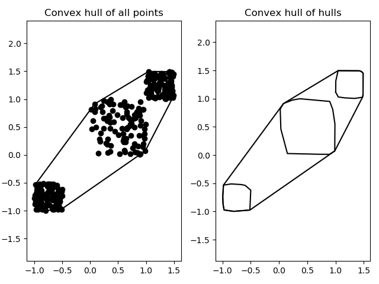

## Algorithm

A convex hull is a container around a group of points (a subset of those points), which has inward acute angles only. This can be any number of dimensions, but is frequently in two for spatial queries. Convex hulls are a subset of the space define by a bounding box (also called extent), and superset of the true polygon. 

A simple [convex hull algorithm](https://www.oreilly.com/ideas/an-elegant-solution-to-the-convex-hull-problem) using some linear algebra is as follows:

1. Choose left- and right-most points $\vec{U}$ and  $\vec{V}$
2. Include $\vec{U}$ and  $\vec{V}$ in the hull, and bisect the set with $\vec{U}-\vec{V}$
3. For each half, choose the furthest point $\vec{W}$
4. Discard points inside triangle $\Lambda (\vec{U},\vec{V},\vec{W})$
5. Repeat recursively with $\vec{U}-\vec{W}$ and $\vec{V}-\vec{W}$Array libraries with linear algebra, like `numpy`, make this simple. You partition the set by the sign of the cross product with the vector between starting points. We’ll pass in the array by reference, along with indices, and `convex_hull()` will return indices required to reconstruct the hull from the original. This way we don’t need to copy, change, or destroy large amounts of data. 

The indices of each half are passed to `segment()` which determines a far point by the cross product of $\vec{U}-\vec{V}$ and $\vec{W}$. The sign of the cross products of $\vec{U}-\vec{W}$ and $\vec{V}-\vec{W}$ with $\vec{W}$ are used to choose new members, and the process continues until there are no candidates remaining. 


## Implementation

The following is a Python function that does this, and saves an image:


```python
from numpy import random, argmax, argmin, cross, argwhere, arange, array, hstack, vstack
from matplotlib import pyplot as plt


def segment(u, v, indices, points):

    if indices.shape[0] == 0:
        return array([], dtype=int)

    def crossProduct(i, j):
        return cross(points[indices, :] - points[i, :], points[j, :] - points[i, :])

    w = indices[argmin(crossProduct(u, v))]
    a = indices[argwhere(crossProduct(w, v) < 0).flatten()]
    b = indices[argwhere(crossProduct(u, w) < 0).flatten()]

    return hstack((segment(w, v, a, points), w, segment(u, w, b, points)))


def convex_hull(points):

    u = argmin(points[:, 0])
    v = argmax(points[:, 0])
    indices = arange(0, points.shape[0])
    parted = cross(points[indices, :] - points[u, :], points[v, :] - points[u, :]) < 0

    a = indices[argwhere(~parted)]
    b = indices[argwhere(parted)]

    return hstack((u, segment(v, u, a, points), v, segment(u, v, b, points), u))


groups = (
    random.random((100, 2)),
    0.5*random.random((100, 2)) + 1,
    0.5*random.random((100, 2)) - 1
)

hulls = tuple(map(convex_hull, groups))
hullsUnion = vstack(tuple(group[hi, :] for hi, group in zip(hulls, groups)))
union = convex_hull(hullsUnion)
pts = vstack(groups)
subset = convex_hull(pts)

fig, ax = plt.subplots(1, 2)
ax[0].set_title("Convex hull of all points")
ax[0].axis("equal")
ax[0].scatter(pts[:, 0], pts[:, 1], color="black")
ax[0].plot(pts[subset, 0], pts[subset, 1], color="black")

ax[1].set_title("Convex hull of hulls")
ax[1].axis("equal")
ax[1].plot(hullsUnion[union, 0], hullsUnion[union, 1], color="black")
for hull, group in zip(hulls, groups):
    ax[1].plot(group[hull, 0], group[hull, 1], color="black")

fig.tight_layout()
fig.savefig(fname="convex-hull.png", bgcolor="none")
```


This can be used as a library, to help handle a lot of polygon data. The convex hull of the union of hulls, is also the convex hull of all points contained. This means you write nice `map()` and `reduce()` functions to sort and associate complex shapes without needing to do point-in-polygon calculations. 




However, only aggregation works this way, and not removing convex hulls. If a polygon is going to be removed, the union will need to be recalculated from the source data.

The code can also be deployed as a simple service, similar to thumbnail image endpoints for cloud storage. Putting this info in the header of an object store lets you identify and prioritize datasets of interest, without them being fully ingested into a database that supports and is set up for spatial queries. 