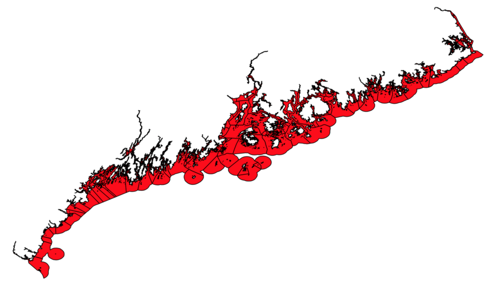

I made some predictions about the continued expansion of aquaculture in Maine. 
Now that we have 2 more years of data and are 40% through a **5-year forecast**, 
let's look back at the early concept: *for long-term predictions, 
you need to model human behavior, not just the environment.*

If you are unfamiliar with the area, the coastal town jurisdictions are shown in red below.

Maine farmers cultured \$6.7M in mussels, oysters, and clams in 2015, and $8M in 2016 (Maine Department of Marine Resources): e
xceeding federal growth benchmarks [1]. Leasing is **decentralized and reactive**, with exclusion criteria including water uses, 
public assets, and lease density. Larger operations improve efficiency, and attract processing facilities—but there is 
concern about the size of firms [2]. Residents closest to farms view them as locally undesirable [3], and decentralized 
expansion — including limited-purpose licenses (table below) — is unlikely to balance production with social acceptance.

| | Standard lease | Limited-purpose license |
|----|----|----|
| Hearing | Yes | No |
| Area | 0–100 acres | 400 sq. ft. |
| Term | 10 years | 1 year| 
|  Density | None | 4 per 1000 ft. radius |

Sustainable growth instead requires evaluating how **scale** matches **community objectives**. 
Targeted **non-marginal investment**, coordinated through voluntary bay management [2], can increase income and equity.

In **single-bay management** (SBM), industry cooperatives unify siting and culture practice. 
Objectives are to lower expenses, and fix or increase price. New sites have a mean frequency ($ λ  $, y-1), 
such that new arrivals follow a Poisson counting process. Damariscotta River had 91 LPAs as of 2017. Issuance is 191 y-1, 
accelerating by 30 y-2 (DMR). Spacing restrictions give a footprint around 0.024 km2. 
Given a window of size $ A_0  $, and a set of $ N  $ existing leases, no viable space will remain 
in jurisdiction area $ A  $ after $ t=A(41.66A_0-N)(\lambda A_0)^{-1}  $. 

A less ideal packing efficiency that accounts for operators buffering themselves is 0.093 km2, which significantly reduces these estimates. 

Growth may vary across tens of meters, so siting is fine-scale (figure below). New locations are sampled from a kernel density estimator, 
trained on existing locations, depth, and satellite-derived oyster suitability. With projected growth, there are >200 sites in the region 
by year 3 (table below). Mean $ t  $ is 15 years, without considering competing uses or closures. Less than 22% allocation, 
and some jurisdictions are already full. The model makes assumptions about space and market conflicts, given the area has a unique aquaculture history.

| Year |$ N $|$ \lambda $|$ t $|$ min(t) $|
|---|---|---|---|---|
| 0 | 91 | 36.4 | 15.2 | 0.001 |
| 1 | 127 | 37.0 | 14.9 | <0 |
| 2 | 164 | 37.6 | 14.5 |<0 |
| 3 | 202 | 38.2 | 14.1 | <0 | 

One alternative is **site allocation planning** (SAP), which delineates growing zones [5] by environment and conflicting uses 
(e.g. Maryland Natural Resource Code 4-11A-05). Production can be optimized within a given footprint. 
Area incentives like credits or subsidies are structured at or above the municipal level—changing $ λ  $ within a 
jurisdiction—while shore facilities create point amenities. **Multi-stakeholder boards** (MSB) seek granular 
siting input, and increased municipal involvement [2]. This aids information gathering, and increases legitimacy [6].

<figcaption>Damariscotta River showing oyster suitability index (OSI). The field is a quadratic reconstruction of raster data on a triangular mesh (R2=0.72). Red is existing limited-purpose licenses (N=91);  blue predicted locations (N=100) based on SBM assumptions. <a href="https://oceanicsdotio.nyc3.digitaloceanspaces.com/bathysphere/images/damariscotta.tiff">Hi-res</a>.  Data: ME OIT, UMaine, Oceanicsdotio</figcaption>

Potential drawbacks include exclusion, and prolonged process. Neighborhood attitudes as expressed at hearings [3] can 
be used to create probabilities of opposition. This approaches zero when a community has few farms, complaints, or low 
willingness-to-pay. While towns and regional co-management groups **shall not** exclude aquaculture, 
they can engage in planning exercises to determine how siting can be structured in a desirable way through manipulation of
 the amenity field ($m-2y-1).
 
This is just one of many methods we use to develop strategic plans for water quality management.

1. NOAA Marine Aquaculture Strategic Plan FY 2016-2020. 
2. Governor’s Task Force on the Planning and Development of Marine Aquaculture (2004).
3. Evans et al. (2017). Ag. &amp; Resource Econ. Rev.
4. Snyder et al. (2017). Fron. in Mar. Sci.
5. Sanchez-Jerez et al. (2016). Aqua. Env. Inter.
6. Cash et al. (2003). SSRN E. Journal.