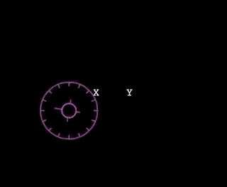

Web developers generally frown on modifying the cursor, but cursors block the point you are trying to look at, 
and I really dislike buttons. So I'm experimenting with context tools to replace more traditional GUI forms. 

Getting all the features we want into the interface without feeling cluttered is a major challenge. One of the 
undesirable effects of having popups triggered by mouse hovers on Mapbox GeoJSON features, is the flickering as you 
move across the map. Sticky selection cursors and particle physics effects adopted from some previous work help prevent 
unintentional context switching, and smooths the transitions between control points. 

The experimental reticule interface can convey a lot of information, and improve user experience in a target rich map UI.

Not sure if this will make it to production, but it was a unusual and fun small project. All of the actions can be 
expressed semantically, and will be available through text input and keyboard commands. We realize that not everybody 
wants to or can click-click things, but we're not quite there with the natural language query interface. 
More on that coming soon. 

